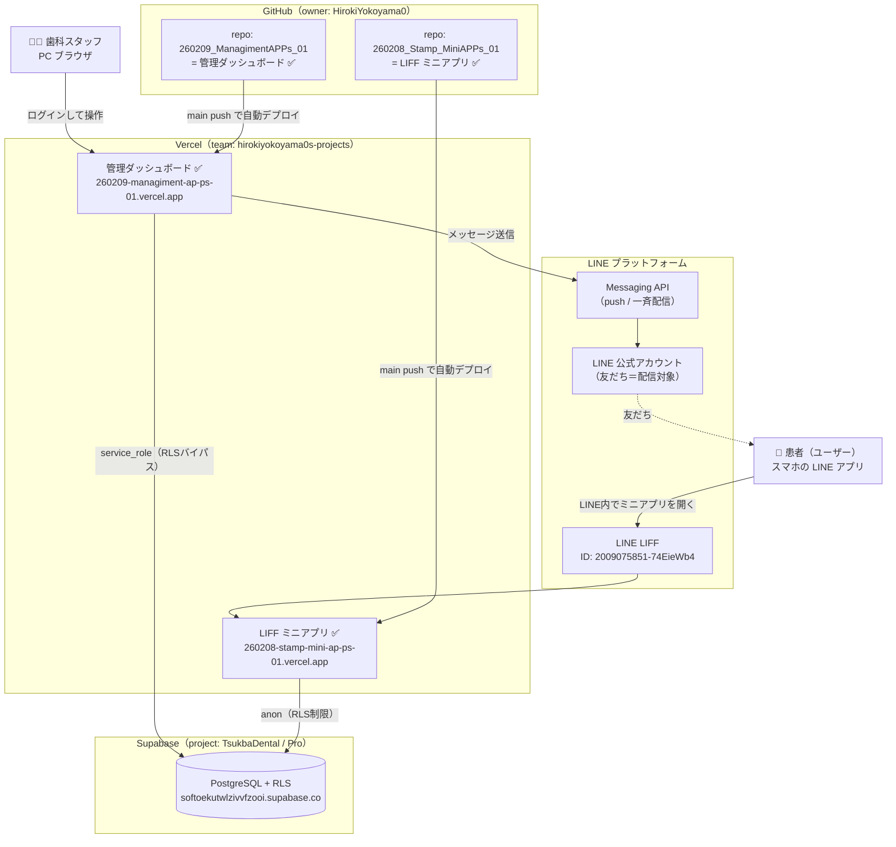
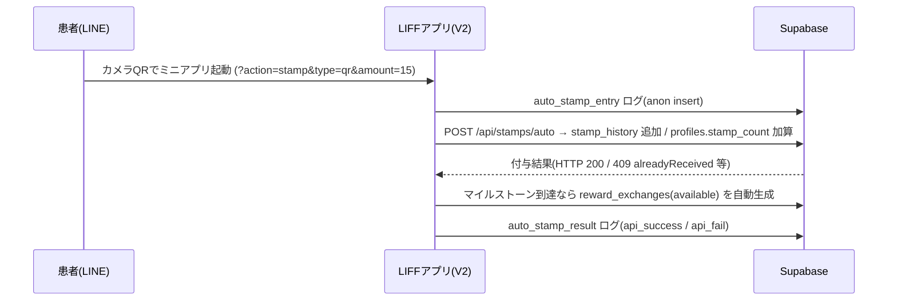
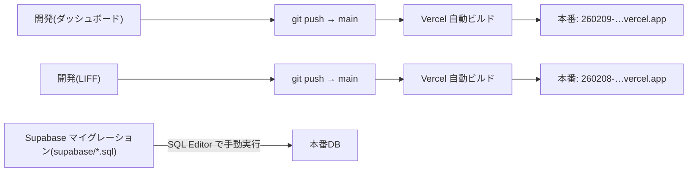

# 0A_全体システム構成

**作成日**: 2026-09-26
**目的**: 管理ダッシュボードと LIFF ミニアプリを含む**システム全体**の構成・デプロイ環境（LINE / Supabase / Vercel / GitHub の関係）を1枚で把握する。
**対象**: 管理ダッシュボード開発者 / LIFF アプリ開発者 / 運用者
**ステータス**: 🟢 LIFF 側の🟡を **LIFF 開発者が確定**（2026-09-26・§9.1）。ダッシュボード側の✅は元 repo 準拠

---

## 0. この文書の見方（凡例）

- ✅ **確定**: 本リポジトリ（管理ダッシュボード `260209_ManagimentAPPs_01`）のコード・設定・ドキュメントから確認済み。
- 🟡 **要確認**: 本 repo からの推定。LIFF 側リポジトリ/環境が正本なので、LIFF 開発者に確認が必要。

---

## 1. 全体構成図（ひとめ用）

**一言でいうと**：
- **2つのアプリ**（管理ダッシュボード / LIFF ミニアプリ）が、**1つの Supabase(TsukbaDental) を共有**。
- 両アプリとも **GitHub → Vercel の自動デプロイ**。Vercel プロジェクトは別々。
- ダッシュボードは **service_role**（全権）、LIFF は **anon**（RLSで制限）で同じ DB にアクセス。
- ダッシュボードのみ **LINE Messaging API** で配信。患者は **LINE → LIFF** 経由でミニアプリを使う。

---

## 2. 外部プラットフォーム（4つ）

| プラットフォーム | 役割 | 補足 |
|---|---|---|
| **LINE** | ①公式アカウント（友だち＝配信対象）②LIFF（ミニアプリの起動基盤）③Messaging API（配信） | LIFF ID `2009075851-74EieWb4` ✅ |
| **Supabase** | 共有データベース（PostgreSQL）＋ RLS ＋（LIFF用の）anon 認証 | project `TsukbaDental`・**Pro**・`softoekutwlzivvfzooi.supabase.co` ✅ |
| **Vercel** | 両アプリのホスティング＆自動デプロイ | team `hirokiyokoyama0s-projects` ✅ |
| **GitHub** | 両アプリのソース管理＆デプロイtrigger | ダッシュボード repo ✅ / LIFF repo は別 🟡 |

---

## 3. 2つのアプリ（比較）

| 項目 | 管理ダッシュボード ✅ | LIFF ミニアプリ 🟡（要確認） |
|---|---|---|
| 利用者 | 歯科スタッフ（PCブラウザ） | 患者（LINE アプリ内） |
| GitHub repo | `HirokiYokoyama0/260209_ManagimentAPPs_01` | `HirokiYokoyama0/260208_Stamp_MiniAPPs_01` ✅ |
| Vercel ドメイン | `260209-managiment-ap-ps-01.vercel.app` | `260208-stamp-mini-ap-ps-01.vercel.app` ✅ |
| フレームワーク | Next.js 15 + React 19 + TypeScript | **Next.js 16.1.6 (App Router)** + React 19.2.4 + TS5 + `@line/liff` 2.26.1 ✅ |
| UI | Tailwind 3.4 + shadcn/Radix + SWR | Tailwind 3.4 + lucide-react + SWR + html5-qrcode ✅ |
| 認証 | **独自 Cookie セッション**（`simple-auth`・デバイス別 Cookie・middleware で `/admin`・`/api/profiles` を保護） | **LINE ログイン(LIFF)**。スタッフ操作は**共有PIN** `NEXT_PUBLIC_STAFF_PIN`（未設定時 `"1234"` にフォールバック）✅ |
| Supabase アクセス | **service_role**（`lib/supabase/server-admin.ts`・RLSバイパス） | **anon キー**（RLS で制限）✅ ※`getSupabaseAdmin()` は定義のみ・APIルート未使用 |
| 主な責務 | 患者/スタンプ/特典/家族/アンケート/ケア記録の管理、**一斉配信**、各種ログ閲覧 | QRスキャンでのスタンプ付与、特典の閲覧・交換申請、会員証表示、行動ログ送信 |
| 主なAPI | `/api/profiles`, `/api/reward-exchanges`, `/api/event-logs`, `/api/broadcast/send` ほか | **約23本**: `/api/stamps/*`(auto/scan/manual/slot/delete-today)・`/api/rewards/exchange`・`/api/users/*`・`/api/families/*`・`/api/survey/*`・`/api/profiles/[id]` ✅（[124](124_コードベース棚卸し_実態調査レポート.md)） |

> ダッシュボードの技術詳細は [01_ファイル構成.md](01_ファイル構成.md) / [03_管理ダッシュボード仕様書.md](03_管理ダッシュボード仕様書.md)。

---

## 4. 共有 Supabase（1つの DB を2アプリで共有）

- **project**: `TsukbaDental`（Pro / `softoekutwlzivvfzooi.supabase.co`）✅
- **主なテーブル**（`supabase/` マイグレーション由来）✅
  `profiles` / `stamp_history` / `families` / `reward_exchanges` / `milestone_rewards` / `milestone_history` / `staff` / `activity_logs` / `event_logs` / `surveys`系 / `broadcast_logs` / `care_messages` / `patient_dental_records`
- **RLS モデル（重要）**
  - **ダッシュボード = service_role**：RLS をバイパスして全操作（管理・集計・配信ログ）。
  - **LIFF = anon**：RLS ポリシーで許可された操作のみ。
    - 例：`event_logs` は anon INSERT のみ（閲覧は service_role）。
    - 例：`reward_exchanges` は anon で **`available → pending` の遷移のみ許可**（`supabase/033`）。同一マイルストーンの重複有効行は**部分ユニーク** `uq_reward_active`（`supabase/034`）で構造的に禁止。
  - 詳細は [05_Database_Schema.md](05_Database_Schema.md) / [129_マイルストーン特典重複_対応完了報告.md](129_マイルストーン特典重複_対応完了報告.md)。

> ⚠️ **RLS の述語は「LIFF exchange / DB制約 / ダッシュボード dedup」の三者で一致**させること。ズレると重複や失敗が起きる（129 §4 の恒久注意）。

---

## 5. 主要データフロー

### 5-1. カメラQRでスタンプ付与（患者）

### 5-2. 特典交換（患者申請 → スタッフ引渡し）

1. 患者が LIFF で「交換する」→ `reward_exchanges` を **`available → pending`**（anon UPDATE / `033`）🟡
2. スタッフが**ダッシュボード**の特典交換履歴で「完了」→ **`pending → completed`**（service_role）＋兄弟レコードの dedup ✅
   （[app/api/reward-exchanges/[id]/complete/route.ts](../app/api/reward-exchanges/[id]/complete/route.ts)）

### 5-3. 一斉配信（スタッフ → 患者）

- スタッフがダッシュボードで対象を絞って送信 → **LINE Messaging API** 経由で友だちへ push、`broadcast_logs` に記録。✅
  （[lib/line-messaging.ts](../lib/line-messaging.ts) / [lib/broadcast.ts](../lib/broadcast.ts) / [12_一斉配信機能仕様書.md](12_一斉配信機能仕様書.md)）

---

## 6. デプロイパイプライン

- **アプリは main への push で自動デプロイ**（両 repo とも）。✅（ダッシュボード）/ 🟡（LIFF）
- **DB スキーマ変更（`supabase/*.sql`）は自動実行されない**。Supabase の SQL Editor 等で**手動適用**が必要。✅
- Vercel ログの取得手順は [80_Vercelデプロイ準備.md](80_Vercelデプロイ準備.md) §6（トークンでAPI取得）。

---

## 7. 環境変数（要点）

### 管理ダッシュボード（`.env.local` / Vercel Env）✅
| 変数 | 用途 |
|---|---|
| `NEXT_PUBLIC_SUPABASE_URL` / `NEXT_PUBLIC_SUPABASE_ANON_KEY` | Supabase 接続（公開） |
| `SUPABASE_SERVICE_ROLE_KEY` | 管理操作（RLSバイパス）**秘密** |
| `AUTH_SECRET` | Cookie 署名 **秘密** |
| `ADMIN_USER` / `ADMIN_PASSWORD` | 管理ログイン（フォールバック） |
| `Channel_ID` / `Channel_secret`（LINE） | Messaging API（一斉配信/push） |
| `NEXT_PUBLIC_LIFF_ID` | LIFF ID（QR生成・連携用） |
| `VERCEL_TOKEN` / `VERCEL_PROJECT_ID` / `VERCEL_TEAM_ID` | Vercel ログ取得（[80](80_Vercelデプロイ準備.md) §6）|

### LIFF ミニアプリ ✅（本 repo `.env.local` で確認・2026-09-26）
| 変数 | 用途 | 必須 |
|---|---|---|
| `NEXT_PUBLIC_SUPABASE_URL` / `NEXT_PUBLIC_SUPABASE_ANON_KEY` | Supabase 接続（**anon**） | ✅ |
| `NEXT_PUBLIC_LIFF_ID` | LIFF 初期化（`2009075851-74EieWb4`） | ✅ |
| `SUPABASE_SERVICE_ROLE_KEY` | **APIルートでは未使用**（`scripts/` の運用・調査用のみ） | 任意 |
| `VERCEL_TOKEN` | Vercel ログ取得（`npm run logs` → [81_実行コマンド.md](81_実行コマンド.md)） | 任意 |
| `NEXT_PUBLIC_STAFF_PIN` | スタッフ手動操作の共有PIN。**未設定時は `"1234"` にフォールバック** | 任意 |

> LIFF は **LINE Messaging 系（`Channel_ID`/`Channel_secret`）を持たない**（配信はダッシュボード専任・`lib/`・`app/` に実装なし）。§9.1-4 参照。

---

## 8. リポジトリ間の運用ルール

- **ドキュメント番号・マイグレーションは repo ごとに独立**。同じ番号でも別物（ダッシュボードの `Doc_dashboard/` と LIFF の `Doc_miniApps/` 等）。相互リンクや `../app/...` は**開く repo によって解決先が変わる**。（[129 §4](129_マイルストーン特典重複_対応完了報告.md)）
- 患者名・診察券番号を含む**調査スクリプト/CSV/JSON はコミットしない**（`.gitignore` 済み）。
- LINE 側の識別子（LIFF ID / チャネル）と Supabase project は**両アプリで共通**。

---

## 9. LIFF 開発者への確認事項（🟡 の検証）

以下は本 repo からの**推定**です。正しいか確認・修正をお願いします。

1. LIFF アプリの **GitHub repo 名 / owner**（本書は「別 repo・260208 系」と記載）
2. LIFF の **Vercel プロジェクト名**（`260208-stamp-mini-ap-ps-01.vercel.app` で正しいか）
3. LIFF の **API ルート**（`/api/stamps/auto`・`/api/stamps/manual`・`/api/rewards/exchange` の3つで網羅されているか）
4. LIFF の **環境変数**一覧（§7 の推定で過不足ないか。特に LINE Messaging 系を LIFF 側でも持っているか）
5. LIFF の **フレームワーク/バージョン**（Next.js 系で正しいか）
6. LIFF が **Supabase を anon 以外でも触るか**（サーバAPIで service_role を使う箇所の有無）

---

## 9.1 LIFF開発者からの回答（本 repo `260208_Stamp_MiniAPPs_01` で確定・2026-09-26）

§9 の🟡はすべて確定。**結論：0A の LIFF 記載はおおむね正しい。要修正は「主なAPIは3本ではなく約23本」「フレームワークは Next.js 16.1.6」「service_role は定義のみでAPIルート未使用」の3点。**

1. **repo / owner**：`HirokiYokoyama0/260208_Stamp_MiniAPPs_01`（`git remote` で確認）。✅
2. **Vercel プロジェクト**：project `260208-stamp-mini-ap-ps-01` ／ ドメイン `260208-stamp-mini-ap-ps-01.vercel.app` ／ team `hirokiyokoyama0s-projects` ／ projectId `prj_ESIfQZTdnFJzwPz12DC5eP3pvPY4`（Vercel API で実確認）。✅
3. **API ルート**：**3本ではなく約23本**。主な群：
   - スタンプ：`/api/stamps`・`/api/stamps/auto`（カメラQR）・`/api/stamps/scan`（アプリ内・[123](123_アプリ内スキャン機能_一時無効化.md)で一時無効）・`/api/stamps/scan/delete-today`・`/api/stamps/slot`・`/api/stamps/manual`
   - 特典：`/api/rewards/exchange`（`/api/rewards` GET は未使用）／スロット：`/api/slot/unlock`
   - ユーザー：`/api/users/me`・`/api/users/setup-role`・`/api/users/[userId]/memo`・`/api/users/[userId]/reservation-click`
   - 家族：`/api/families/{create,join,me,update,members/add,members/[memberId]}`
   - アンケート：`/api/survey/{check,submit,postpone}` ／ プロフィール：`/api/profiles/[profileId]`
   - 全一覧は [124_コードベース棚卸し](124_コードベース棚卸し_実態調査レポート.md) §1。
4. **環境変数**：§7 の LIFF 表を確定値に更新済み。**LINE Messaging 系（`Channel_ID`/`Channel_secret`）は LIFF 側に無い**（`lib/`・`app/` に messaging/push 実装なし＝配信はダッシュボード専任）。`SUPABASE_SERVICE_ROLE_KEY`/`VERCEL_TOKEN` は保持するが、前者は**APIルート未使用**。✅
5. **フレームワーク**：**Next.js 16.1.6（App Router）+ React 19.2.4 + TypeScript 5 + Tailwind 3.4.1**、`@line/liff` 2.26.1、`@supabase/supabase-js` 2.95.3、`html5-qrcode`、`lucide-react`、`swr`。※ダッシュボード(Next 15)より新しい。✅
6. **service_role の使用**：**現行の API ルートは全て anon**。`getSupabaseAdmin()`（service_role）は [lib/supabase.ts](../lib/supabase.ts#L17) に定義があるが**どの API ルートからも呼ばれていない**（＝リクエスト経路では未使用。過去に exchange で試み→revert。[107]/[128 §6-1] の「LIFFはservice role不可」と整合）。service_role は `scripts/` の運用・調査用途のみ。→ 0A の「LIFF=anon」は正しい。✅

> ⚠️ **doc番号の注意**：0A は元々ダッシュボード repo 由来のため、本文中の一部リンク（`05_Database_Schema.md`・`129_マイルストーン特典重複…`・`80_Vercelデプロイ準備.md`・`01_ファイル構成.md` 等）は**ダッシュボード repo の文書**を指す。LIFF repo 側の対応文書は別番号（Vログ取得＝[81_実行コマンド.md](81_実行コマンド.md)／DBスキーマ＝[05_Database_Schema.md](05_Database_Schema.md)／ログ計装＝[129_管理ダッシュボード開発者へ_ログ計装修正の事前確認_auto_stamp_entry_app_open.md](129_管理ダッシュボード開発者へ_ログ計装修正の事前確認_auto_stamp_entry_app_open.md)）。§8 の注記どおり、番号は repo ごとに独立。

---

## 改訂履歴
| 日付 | 内容 |
|------|------|
| 2026-09-26 | 初版作成（全体構成図・2アプリ比較・データフロー・デプロイ・環境変数・LIFF側要確認）|
| 2026-09-26 | **LIFF開発者が §9 の🟡を確定**（§9.1 追記・§3/§7 の LIFF 値を更新・mermaid/ステータス更新）。主API=約23本／Next.js 16.1.6／service_role はAPIルート未使用／Messaging 系なし を明記 |
