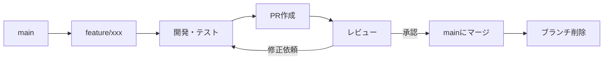

# 開発ルールとコラボレーションガイドライン

## 📋 目次
1. [基本原則](#基本原則)
2. [作業分担とバッティング回避](#作業分担とバッティング回避)
3. [ブランチ戦略](#ブランチ戦略)
4. [コミットルール](#コミットルール)
5. [コンフリクト解消方針](#コンフリクト解消方針)
6. [コードレビュープロセス](#コードレビュープロセス)
7. [ドキュメント管理](#ドキュメント管理)
8. [緊急時対応](#緊急時対応)

---

## 基本原則

### 1. コミュニケーション最優先
- 🗣️ **作業開始前に必ず宣言**する
- 📢 **作業中のファイル・機能を明確にする**
- ⏰ **完了予定時刻を共有する**

### 2. 作業の透明性
- ✅ どのコミットから作業しているか明示
- ✅ 変更範囲を事前に伝える
- ✅ 進捗を定期的に報告

### 3. 相互尊重
- 🤝 他者の実装を理解してから変更
- 💬 疑問点は遠慮なく質問
- 🔄 レビューフィードバックを前向きに受け入れる

---

## 作業分担とバッティング回避

### 担当領域の明確化

#### キッズ担当者
**対象ファイル:**
```
components/(kids)/*
app/child-mode/*
キッズモード関連のUI・デザイン
スロットゲーム機能
```

**作業前チェックリスト:**
- [ ] 最新のmainをpull済み
- [ ] 作業開始コミットを共有済み
- [ ] 変更ファイルリストを宣言済み

#### 大人用・共通機能担当者（Claude等）
**対象ファイル:**
```
components/(adult)/*
app/family/*
contexts/*
lib/*
API Routes
データベーススキーマ
認証・セキュリティ
```

**作業前チェックリスト:**
- [ ] キッズ担当者の作業状況を確認
- [ ] 共通ファイル変更時は事前連絡
- [ ] バッティングリスクを評価

---

### バッティング回避の具体策

#### ケース1: 同じファイルを触る必要がある場合

**❌ やってはいけないこと:**
```bash
# 無断でmainに直接コミット
git commit -m "fix: キッズページ修正"
git push origin main
```

**✅ 推奨される方法:**

**方法A: パッチファイルで共有**
```bash
# 変更をパッチファイルとして保存
git diff > feature-name.patch

# patches/ディレクトリに保存 + README付き
mkdir -p patches
mv feature-name.patch patches/
# README.mdに適用手順を記載
git add patches/
git commit -m "docs: [担当者名]向けパッチファイル追加"
git push origin main
```

**方法B: レビュー用ブランチ**
```bash
# 専用ブランチを作成
git checkout -b feature/your-feature-name

# 変更をコミット
git add .
git commit -m "feat: 機能説明（レビュー用）"

# リモートにpush
git push -u origin feature/your-feature-name

# 担当者に通知（マージは相手に任せる）
```

**方法C: 作業完了を待つ**
```bash
# 担当者の作業完了後にpull
git pull origin main

# その後に実装
```

#### ケース2: 緊急修正が必要な場合

**優先順位:**
1. セキュリティ・バグ修正 > 機能追加
2. 本番影響あり > 開発環境のみ
3. データ破損リスク > UI/UX改善

**手順:**
```bash
# 1. 緊急度を判断
# 2. 担当者に緊急連絡（可能な場合）
# 3. hotfixブランチで修正
git checkout -b hotfix/security-fix
git commit -m "hotfix: セキュリティ修正"
git push origin hotfix/security-fix

# 4. 即座にmainにマージ
# 5. 担当者にマージ通知
```

---

## ブランチ戦略

### ブランチ命名規則

```
main                          # 本番デプロイ可能な状態
├── feature/機能名            # 新機能開発
├── fix/バグ名                # バグ修正
├── hotfix/緊急修正名         # 緊急修正
├── docs/ドキュメント名       # ドキュメントのみ
└── refactor/リファクタ名     # コード整理
```

**例:**
```bash
feature/kids-back-button
fix/stamp-count-calculation
hotfix/auth-security
docs/api-documentation
refactor/dental-record-components
```

### ブランチのライフサイクル



**ブランチ削除のタイミング:**
- ✅ mainにマージ完了後
- ✅ 全ての変更が反映済み
- ✅ コンフリクト解消済み

```bash
# ローカル削除
git branch -d feature/xxx

# リモート削除
git push origin --delete feature/xxx
```

---

## コミットルール

### コミットメッセージフォーマット

```
<type>: <subject>

## <セクション名>
- 詳細説明

🤖 Generated with [Claude Code](https://claude.com/claude-code)

Co-Authored-By: <担当者名> <email>
```

### Type分類

| Type | 説明 | 例 |
|------|------|-----|
| `feat` | 新機能追加 | `feat: キッズモード戻るボタン追加` |
| `fix` | バグ修正 | `fix: スタンプカウント計算エラー修正` |
| `docs` | ドキュメント変更 | `docs: API仕様書更新` |
| `style` | コードフォーマット | `style: ESLint警告解消` |
| `refactor` | リファクタリング | `refactor: 認証ロジック整理` |
| `test` | テスト追加・修正 | `test: 家族機能のテスト追加` |
| `chore` | ビルド・設定変更 | `chore: 依存関係更新` |
| `hotfix` | 緊急修正 | `hotfix: セキュリティ脆弱性修正` |

### コミット粒度

**✅ 良い例:**
```bash
git commit -m "feat: スタンプ履歴表示機能を追加"
git commit -m "fix: 日付フォーマットのバグ修正"
git commit -m "docs: スタンプAPI仕様書を更新"
```

**❌ 悪い例:**
```bash
git commit -m "色々修正"  # 何を変更したか不明
git commit -m "WIP"       # 作業中のまま放置
```

---

## コンフリクト解消方針

### 基本ルール

1. **UI/デザイン変更 > ロジック変更**
   - デザインは後から変更しやすい
   - ロジックは壊れると影響大

2. **最新の変更を優先**
   - タイムスタンプが新しい方
   - より良い実装がされている可能性

3. **担当者の意図を尊重**
   - 自分の領域の変更は自分が最終判断
   - 不明な場合は必ず確認

### コンフリクト解消手順

```bash
# 1. 最新のmainを取得
git fetch origin main

# 2. ローカルでマージを試みる
git merge origin/main

# 3. コンフリクトを確認
git status

# 4. ファイルを開いて手動解決
# <<<<<<< HEAD
# あなたの変更
# =======
# 相手の変更
# >>>>>>> origin/main

# 5. 解決後にステージング
git add <解決したファイル>

# 6. マージコミット
git commit -m "merge: mainをマージしてコンフリクト解消"

# 7. テスト実行
npm run build
npm run lint

# 8. push
git push origin main
```

### コンフリクト事例と解消方針

#### 事例1: 背景色の変更（今回のケース）

**状況:**
- あなた: `from-kids-pink via-kids-yellow to-kids-blue`
- 相手: `from-purple-100 via-blue-50 to-sky-100`

**解消方針:**
```
✅ 相手の変更を優先（デザイン担当者の判断を尊重）
✅ ロジック部分（戻るボタン）は自分の変更を保持
```

#### 事例2: 関数名の変更

**状況:**
- あなた: `handleClick()` に変更
- 相手: `handleButtonClick()` に変更

**解消方針:**
```
1. より具体的な名前を採用 → handleButtonClick()
2. 全ての呼び出し箇所も統一
3. コメントで変更理由を記載
```

#### 事例3: 依存関係の追加

**状況:**
- あなた: `import { useRouter } from "next/navigation"`
- 相手: `import { useRouter } from "next/router"`

**解消方針:**
```
1. Next.js 13以降 → "next/navigation" が推奨
2. 両方必要な場合は別名でimport
   import { useRouter } from "next/navigation"
   import { useRouter as useRouterLegacy } from "next/router"
```

---

## コードレビュープロセス

### プルリクエスト（PR）作成ガイドライン

**PR タイトル:**
```
[機能分類] 簡潔な説明
```

**PR 説明テンプレート:**
```markdown
## 概要
この変更の目的と背景

## 変更内容
- 変更1
- 変更2

## テスト
- [ ] ビルド成功
- [ ] 手動テスト完了
- [ ] エッジケース確認

## スクリーンショット（UI変更の場合）
（画像添付）

## 影響範囲
どの機能・画面に影響するか

## レビュー観点
特に確認してほしいポイント
```

### レビュー観点

**機能面:**
- [ ] 要件を満たしているか
- [ ] エッジケースに対応しているか
- [ ] エラーハンドリングは適切か

**コード品質:**
- [ ] 命名規則に従っているか
- [ ] 重複コードはないか
- [ ] パフォーマンスは問題ないか

**セキュリティ:**
- [ ] 入力値検証は適切か
- [ ] 認証・認可は正しいか
- [ ] 機密情報の漏洩はないか

**UI/UX:**
- [ ] デザインガイドに従っているか
- [ ] アクセシビリティは考慮されているか
- [ ] レスポンシブ対応は十分か

### レビューフィードバックの書き方

**✅ 良い例:**
```markdown
## 指摘: セキュリティリスク
`userId` を直接URLパラメータから取得していますが、
認証済みユーザーのIDと一致するか検証が必要です。

**提案修正:**
\`\`\`typescript
if (profile?.userId !== userId) {
  return { error: "Unauthorized" };
}
\`\`\`

## 質問: 実装意図の確認
`useEffect` の依存配列に `[]` を指定していますが、
`profileId` が変更された時も再実行する必要はありませんか？
```

**❌ 悪い例:**
```markdown
ここ変じゃない？
直して
```

---

## ドキュメント管理

### ドキュメントの更新タイミング

**即座に更新:**
- ✅ API仕様変更
- ✅ データベーススキーマ変更
- ✅ 環境変数追加・変更

**機能完成後に更新:**
- ✅ 新機能の仕様書
- ✅ ユーザーガイド
- ✅ 開発手順書

**定期的に見直し:**
- ✅ アーキテクチャ図
- ✅ ファイル構成図
- ✅ 用語集

### ドキュメント配置ルール

```
Doc_miniApps/
├── 00_README.md                    # プロジェクト全体の概要
├── 01_プロジェクト概要.md          # ビジネス要件
├── 02_ファイル構成.md              # 技術構成
├── 05_Database_Schema.md           # DB設計
├── 10_機能仕様書.md                # 機能一覧
├── 20番台/                         # 家族機能関連
├── 30番台/                         # 子供モード関連
├── 40_開発ルール...md              # 本ファイル
├── 90_実装履歴.md                  # 変更履歴
└── archive/                        # 古いドキュメント
```

### コードコメントルール

**関数・コンポーネントレベル:**
```typescript
/**
 * スタンプ履歴を取得する
 *
 * @param userId - ユーザーID（LINE User IDまたはmanual-xxx形式）
 * @param limit - 取得件数（デフォルト: 10）
 * @returns スタンプ履歴の配列
 *
 * @example
 * const history = await fetchStampHistory("U1234567890abcdef", 20);
 */
export async function fetchStampHistory(userId: string, limit = 10) {
  // 実装
}
```

**複雑なロジック:**
```typescript
// ケース1: 代理管理メンバー（manual-で始まるID）
// → id列で直接検索
if (selectedChildId?.startsWith('manual-')) {
  query = query.eq('id', selectedChildId);
}
// ケース2: LIFFユーザー
// → line_user_id列で検索
else {
  query = query.eq('line_user_id', profile.userId);
}
```

**TODO・FIXMEルール:**
```typescript
// TODO: [担当者名] Phase 2で実装予定
// FIXME: [発見者名] スタンプ数が負の値になるバグ修正必要
// HACK: [実装者名] 一時的な回避策、後でリファクタリング
```

---

## 緊急時対応

### 本番環境でバグ発見

**レベル1: クリティカル（即時対応）**
- 🔴 データ破損・損失のリスク
- 🔴 セキュリティ脆弱性
- 🔴 全ユーザーに影響

**対応手順:**
```bash
# 1. 即座にrollback（必要な場合）
git revert <問題のコミット>
git push origin main

# 2. hotfixブランチで修正
git checkout -b hotfix/critical-bug
# 修正実装
git commit -m "hotfix: クリティカルバグ修正"
git push origin hotfix/critical-bug

# 3. mainにマージ
git checkout main
git merge hotfix/critical-bug
git push origin main

# 4. 事後報告（Issueやドキュメントに記録）
```

**レベル2: 高（24時間以内）**
- 🟠 特定機能が動作しない
- 🟠 一部ユーザーに影響
- 🟠 パフォーマンス劣化

**レベル3: 中（1週間以内）**
- 🟡 UI/UXの問題
- 🟡 マイナーなバグ
- 🟡 改善要望

### ロールバック手順

**直前のコミットを取り消す:**
```bash
# コミットは残すが変更を打ち消す（推奨）
git revert HEAD
git push origin main

# または、コミット自体を削除（危険）
git reset --hard HEAD~1
git push --force origin main  # チーム確認必須！
```

**特定のコミットを取り消す:**
```bash
# コミットハッシュを確認
git log --oneline -10

# 特定のコミットを取り消す
git revert <コミットハッシュ>
git push origin main
```

---

## チェックリスト

### 🚀 開発開始前
- [ ] 最新のmainをpull済み
- [ ] 作業内容を宣言済み
- [ ] ドキュメントを確認済み
- [ ] 環境変数・設定ファイル最新

### 💻 開発中
- [ ] コミットメッセージは明確
- [ ] コメントは十分に記載
- [ ] 変更範囲は最小限
- [ ] 他の担当者の作業と重複していない

### ✅ コミット前
- [ ] `npm run build` 成功
- [ ] `npm run lint` エラーなし
- [ ] 手動テスト完了
- [ ] 不要なconsole.log削除
- [ ] 機密情報が含まれていない

### 🎉 PR作成時
- [ ] PRタイトル・説明が明確
- [ ] スクリーンショット添付（UI変更時）
- [ ] テスト結果を記載
- [ ] レビュアーを指定

### 🔀 マージ後
- [ ] 不要なブランチを削除
- [ ] ドキュメントを更新
- [ ] チームに完了報告
- [ ] 次のタスクを確認

---

## 今回のケーススタディ

### 状況
- **担当者A（Claude）**: 大人用・共通機能担当
- **担当者B（mioyoko）**: キッズモード担当
- **バッティング**: 5つのキッズファイルを同時編集

### 採用した解決策

1. **パッチファイル作成**
   ```
   patches/kids-back-button.patch  # 変更差分
   patches/README.md               # 適用手順
   ```

2. **レビュー用ブランチ作成**
   ```
   feature/kids-back-button-for-review
   ```

3. **mainには直接コミットせず、選択肢を提供**

### 結果
- ✅ コンフリクトは背景色のみ（4ファイル）
- ✅ ロジック（戻るボタン）は100%採用
- ✅ ビルド成功・エラーなし
- ✅ 協業体制確立

### 学んだベストプラクティス

1. **作業開始コミットを宣言する**
   - 「59a9568から作業中」と明示

2. **変更をパッチファイルで共有**
   - 相手が適用タイミングを選べる

3. **コンフリクト解消の優先順位を明確に**
   - デザイン変更 < ロジック変更

4. **完了後のクリーンアップ**
   - 不要なブランチ・ファイルは削除

---

## まとめ

### 🎯 守るべき3原則

1. **コミュニケーション**
   - 作業前に宣言
   - 進捗を共有
   - 疑問は質問

2. **透明性**
   - 変更範囲を明示
   - コミットメッセージを丁寧に
   - ドキュメントを更新

3. **相互尊重**
   - 担当領域を尊重
   - レビューを真摯に
   - 感謝を忘れない

### 📚 参考資料
- [Conventional Commits](https://www.conventionalcommits.org/)
- [GitHub Flow](https://docs.github.com/en/get-started/quickstart/github-flow)
- [プロジェクト概要](./01_プロジェクト概要.md)
- [子供モード開発ルール](./31_子供モード_開発ルール.md)

---

**最終更新**: 2025-03-15
**作成者**: Claude (AI Assistant) + Project Team
**バージョン**: 1.0
